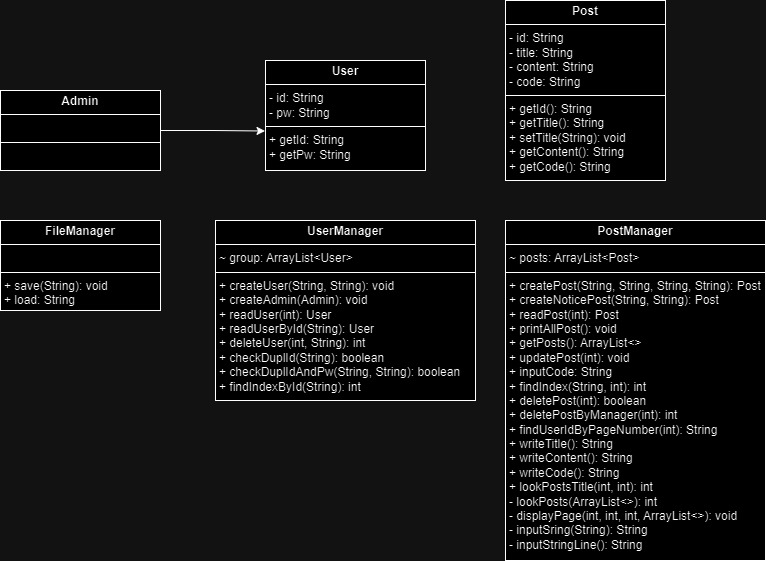

# 게시판

> 소개

자바 모듈에서 실행되는 **미니 게시판**입니다.

 

> 설명
- 회원가입, 회원탈퇴, 로그인, 로그아웃 기능
- 작성하기 기능
- 조회하기 기능
  1. 공지사항 조회
  2. 글 전체 조회
- 마이페이지 기능
  1. 수정
  2. 삭제
- 관리자 기능
  1. 삭제
 
첫 게시판 실행 시, 관리자 계정이 자동으로 추가됩니다. 
관리자 계정의 모든 글은 공지사항으로 올라가며 비밀번호는 0000 입니다. 
 
사용자가 작성하는 모든 글에는 4자리의 비밀번호가 요구되며 
이 비밀번호는 수정, 삭제 시에 필요합니다. (0000은 설정 불가능)
 
 
 

> Class Diagram (UML)

 

> Demo
1.

2.

